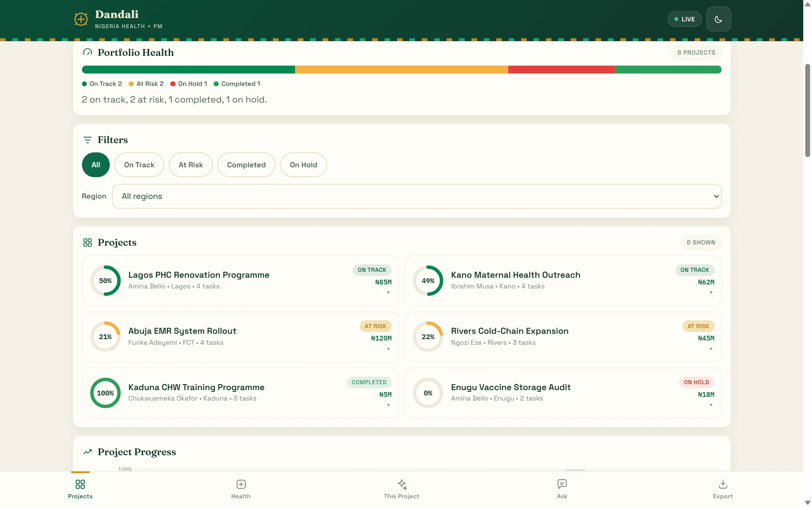
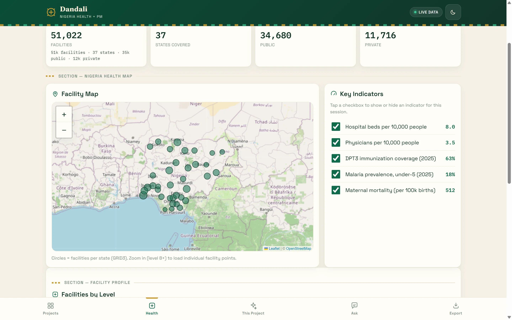
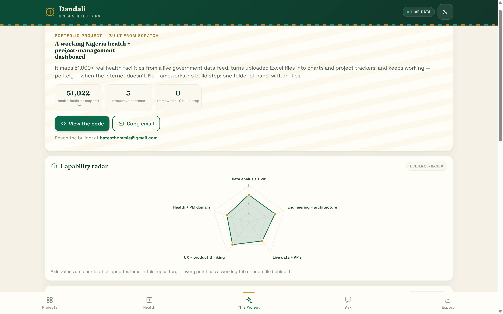
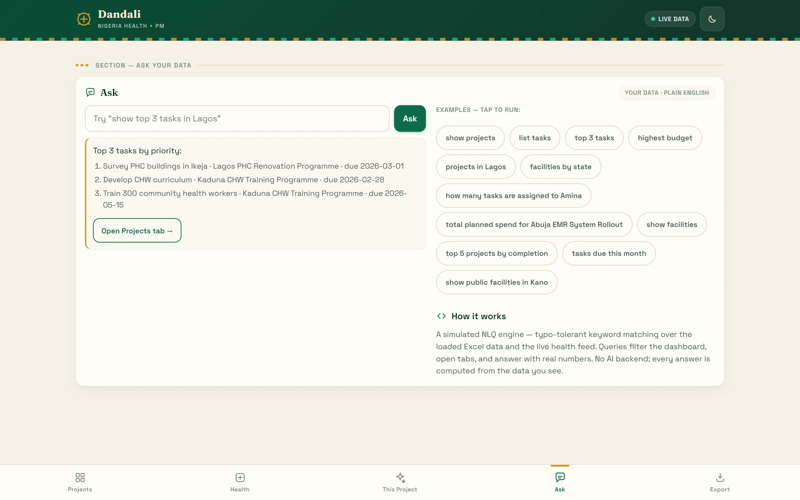
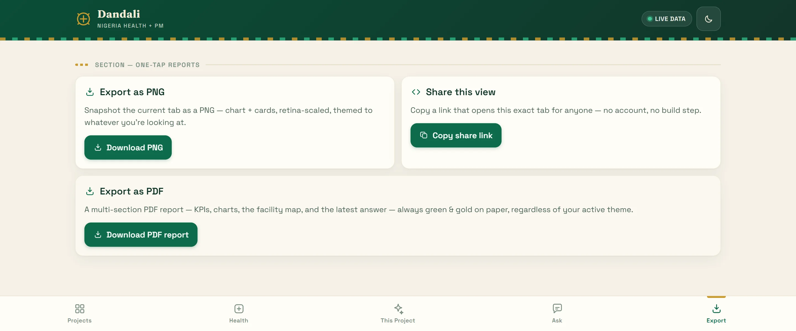
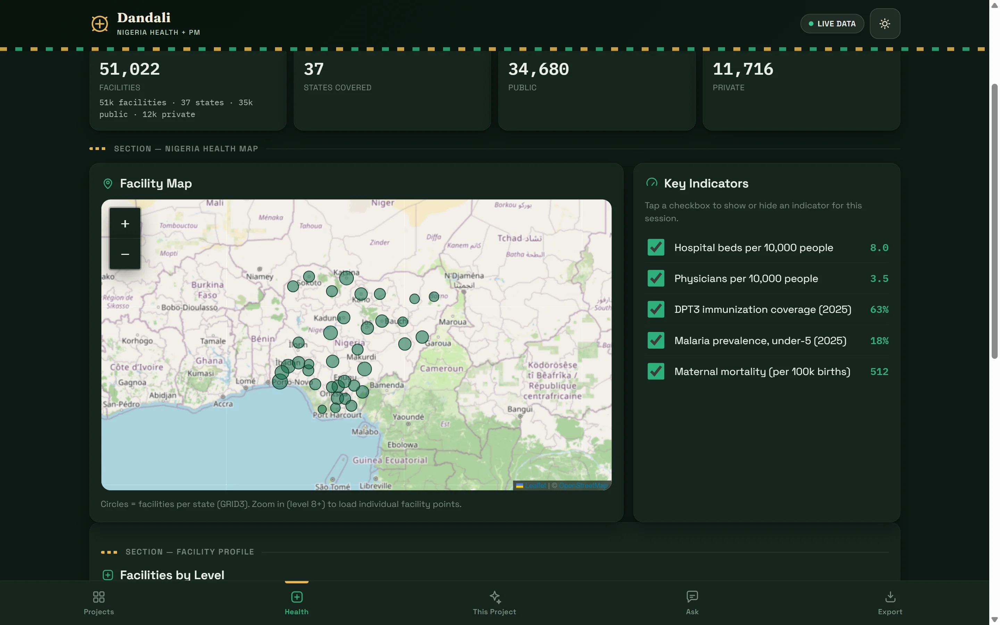
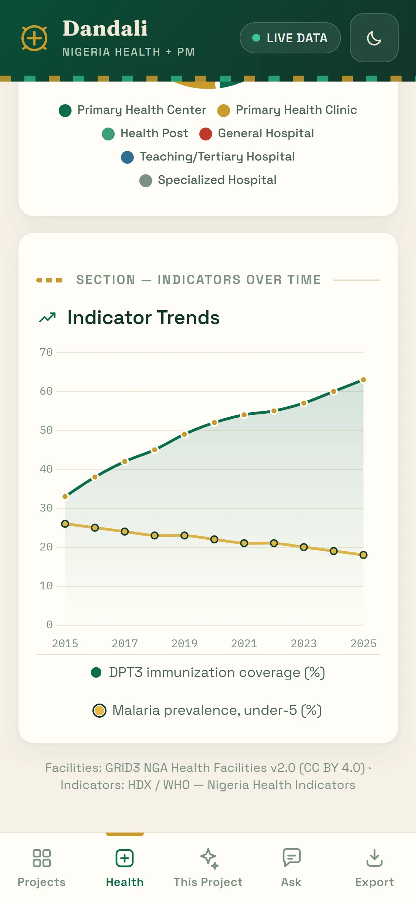

# Dandali

**A Nigeria health + project-management dashboard. No frameworks, no build step.**

[**Open the live demo →**](https://batestguy.github.io/HealthMgtDashboard/)



---

It maps 51,000+ real health facilities from a live government data feed, turns uploaded Excel files
into charts and project trackers, and keeps working — politely — when the internet doesn't.
No frameworks, no build step: one folder of hand-written files.

`51,022 facilities` · `5 sections` · `0 frameworks` · `0 build step`

---

## What's in it

Five tabs, each deep-linkable by hash (`#projects`, `#health`, `#showcase`, `#ask`, `#export`).

### 📋 Projects — `#projects`

Drop a multi-sheet `.xlsx` on the page (or hit **Load sample data**) and the whole tab rebuilds:
four KPIs, a portfolio-health band, status/region filters, project cards with progress rings, six
charts and a task tracker. Files that don't match the schema are rejected with a per-sheet list of
exactly what is wrong.

### 🏥 Health — `#health`



51,022 facilities streamed live from the GRID3 ArcGIS FeatureServer into a Nigeria-framed Leaflet
map with per-state circles and marker clusters, plus a facilities-by-level doughnut, indicator
trend lines and a toggleable key-indicator list. When a feed is unavailable the tab falls back to
seeded sample data and says so on the source line under the KPIs, rather than showing an empty
state. (The amber badge beside it is currently unreliable when only *one* of the two feeds falls
back — see [Known limits](#known-limits).)

### 🚀 This Project — `#showcase`



The default landing tab, written for a non-technical reader: the pitch, a capability radar whose
axes are counts of features actually shipped in this repo, feature→skill cards with "Try it" deep
links into the relevant tab, and a toolchain list.

### 💬 Ask — `#ask`



Type *"show top 3 tasks in Lagos"* or *"how many facilities are in Kano"* and the dashboard answers
with real numbers from the loaded workbook and the live health feed — typo-tolerant, multi-intent,
and able to filter the Projects tab or open another tab as part of its answer. It is keyword
matching, not a language model; see [Known limits](#known-limits).

### 📤 Export — `#export`



A PNG snapshot of the current tab (html2canvas, retina-scaled, themed to whatever you're looking
at), a multi-section jsPDF report — title page, Projects KPIs and charts, Health KPIs and charts,
the latest Ask answer — and a share link that reopens the exact tab you're on.

---

## Light and dark, and a phone

Every colour and font is a CSS custom property on `:root` / `[data-theme="dark"]`. `js/charts.js`
reads those tokens at draw time, so flipping the theme restyles every chart without any chart code
knowing about it. The theme is the one thing the app persists (`localStorage`, key `pm-theme`).

 

The layout is mobile-first — single column, max-width 480px, centred, 44px minimum touch targets,
fixed bottom tab bar.

---

## Run it locally

There is nothing to install and nothing to build. You do need a web server, though — opening
`index.html` over `file://` breaks `fetch` and CORS, so the Excel loader and the health APIs both
fail:

```bash
python -m http.server 8000      # or: npx serve .
# open http://localhost:8000
```

The only `node_modules/` in the repo lives in `tools/`. It is dev-only tooling for regenerating the
demo workbook and never ships:

```bash
cd tools && npm install && npm run generate:sample   # writes ../assets/sample-data.xlsx
```

Deployment is `git push origin main` — GitHub Pages serves the repo root as-is.

---

## Architecture

Each `js/*.js` file is an IIFE that assigns a single `window.PM*` global. There are no ES modules
and no imports; cross-module calls go through those globals, and always defensively
(`if (window.PMApp && PMApp.toast)`), because load order and CDN availability are not guaranteed.

| Global | File | Owns |
|---|---|---|
| `PMApp` | `js/app.js` | Tab routing, Projects tab, theme, shared helpers (`toast`, `goto`, `countUp`). Wires everything — **loads last**. |
| `PMData` | `js/data.js` | SheetJS parse + per-sheet validation + the in-memory dataset |
| `PMCharts` | `js/charts.js` | Chart.js wrappers (`bar`/`groupedBar`/`hbar`/`doughnut`/`line`/`radar`) + the bespoke Health legend |
| `PMHealthData` | `js/health-data.js` | GRID3 facilities, HDX indicators, state centroids, seeded fallbacks |
| `PMMap` | `js/map.js` | Leaflet map, Nigeria-framed, on-demand points by zoom |
| `PMHealth` | `js/health.js` | Health tab controller (KPIs, live/fallback badge, refresh) |
| `PMShowcase` | `js/showcase.js` | "This Project" tab (static, no data layer) |
| `PMNlq` | `js/nlq.js` | Keyword NLQ engine (`parse`, `run`, `EXAMPLES`) |
| — | `js/export.js` | PNG snapshot + share link |
| — | `js/pdf.js` | Multi-section jsPDF report |

**Script order in `index.html` is load-bearing.** With no module system, a file that calls
`PMCharts` must be parsed after `js/charts.js`, and every library a module touches needs a real
`<script>` tag on the page. The order is: Chart.js → SheetJS → jsPDF → html2canvas (all four in
`<head>`) → Leaflet → markercluster → `data` → `charts` → `health-data` → `map` → `health` →
`showcase` → `nlq` → `export` → `pdf` → `app`.

Local `css/` and `js/` references are cache-busted with `?v=N` (currently `?v=14`), because Pages
caches for ~10 minutes and a stale mix of old and new files is the classic "works locally" failure.

---

## Data sources

Two independent sources feed the app, and neither is persisted — reload and the session is empty
again.

**Facilities — GRID3 NGA Health Facilities v2.0.** A keyless ArcGIS FeatureServer
([`services3.arcgis.com/…/GRID3_NGA_health_facilities_v2_0/FeatureServer/0`](https://services3.arcgis.com/BU6Aadhn6tbBEdyk/arcgis/rest/services/GRID3_NGA_health_facilities_v2_0/FeatureServer/0)),
51,022 facilities, WGS84, licensed CC BY 4.0. The app issues group-by count queries on `state`,
`ownership` and `facility_level_option` for the aggregates, and fetches individual points inside a
bounding box only once you zoom in.

**Indicators — HDX HAPI (`hapi.humdata.org`), WHO-sourced.** The public endpoint requires an app
registration, so in practice this call returns 403 and the tab falls back to seeded indicator
series. That is the mixed case: the header pill reads *live* because the facilities are, while the
source line correctly reads *Live GRID3 facilities • Sample indicators (fallback)*.

**Excel.** A five-sheet workbook keyed by `ProjectID`. These are the columns the validator
requires, verbatim — the `%` on `Completion%` and `Allocation%` is part of the header name
(`js/data.js`):

| Sheet | Required columns |
|---|---|
| `Projects` | `ProjectID`, `Name`, `Budget`, `StartDate`, `EndDate`, `Status`, `Owner`, `Region` |
| `Tasks` | `TaskID`, `ProjectID`, `Title`, `Assignee`, `Status`, `Priority`, `DueDate`, `Completion%` |
| `Resources` | `ResourceID`, `ProjectID`, `Type`, `Name`, `Cost`, `Allocation%` |
| `Finances` | `ProjectID`, `Month`, `PlannedSpend`, `ActualSpend`, `Variance` |
| `Locations` | `ProjectID`, `State`, `LGA`, `Latitude`, `Longitude` |

`assets/sample-data.xlsx` is generated deterministically (fixed-seed PRNG) by
`tools/generate-sample-xlsx.js`, so regenerating it produces an identical file.

---

## Tech stack

Everything comes from a CDN `<script>` tag. Nothing that reaches the browser is installed with npm.

| | |
|---|---|
| Charts | Chart.js 4.4.9 |
| Excel | SheetJS (`xlsx`) 0.18.5 |
| Map | Leaflet 1.9.4 + Leaflet.markercluster 1.5.3, OpenStreetMap tiles |
| PDF | jsPDF 4.2.1 |
| PNG | html2canvas 1.4.1 |
| Type | Fraunces (display), Space Grotesk (body), IBM Plex Mono (numerals) |
| Icons | A hand-drawn inline SVG sprite in `index.html` — no icon font, no emoji in the chrome |
| Hosting | GitHub Pages, served from `main` |

---

## Known limits

Written down rather than glossed over. The full acceptance matrix, with evidence, is
`dashboard-spec.md` §9.

- **The Ask engine is fuzzy keyword matching, not an LLM.** Deliberate: a real model needs a
  backend, and this is a static page. Wiring one in is an explicitly future phase.
- **Data is session-only.** Uploaded workbooks and fetched health data live in memory and are gone
  on reload. The theme is the single sanctioned `localStorage` exception.
- **Tested on Chrome only — desktop plus device emulation.** Emulation is not a device. The
  iPhone/Safari, Android/Chrome and Firefox matrix is outstanding, and so is real pinch-zoom on the
  map.
- **Map zoom-to-points is only partially verified.** Clusters, per-state circles and tiles all
  render, but the zoom-8 on-demand point path could not be cleanly exercised without a real
  pinch-zoom pass, because rendering the aggregates re-fits the map to Nigeria.
- **The Health "sample data" badge is wrong in the mixed case.** If only one of the two feeds falls
  back — the usual situation, since HDX 403s — the amber *"Sample data — live source unavailable"*
  badge shows anyway, while the header pill reads *LIVE DATA*. The badge is driven by "did anything
  fall back?" rather than by which source did (`js/health.js`). The **source line is the one to
  trust**; it names each feed separately. Logged as `dashboard-spec.md` §9.3, not yet fixed.
- **The sample workbook is a small demo set** — 6 projects, 20 tasks, 4 resources, 72 finance rows,
  10 locations. It exercises the features; it is not a load test.
- **Seven elements at 375px measure under 44px in the DOM.** Five are the indicator checkboxes
  (24×24), whose `<label for>` stretches an invisible overlay across the full 44px row, so the
  effective tap target is the row — verified with `elementFromPoint` and by clicking each row's
  left, middle and right edge. The other two are the Leaflet and OpenStreetMap attribution links
  (43×11 and 71×11); they are inline links inside a sentence, which WCAG 2.5.8 excepts, and they
  cannot be removed for licensing reasons.

---

## Credits and licence

- Facilities: **GRID3 NGA Health Facilities v2.0**, licensed **CC BY 4.0**.
- Indicators: **HDX / WHO** — Nigeria health indicators.
- Map tiles: **© OpenStreetMap contributors**.

The **code** in this repository is MIT licensed — see [`LICENSE`](LICENSE). That licence covers the
code only: the GRID3 data remains CC BY 4.0 and keeps its in-app attribution, and the OpenStreetMap
tiles keep theirs.

Built by [batestguy](https://github.com/batestguy).
